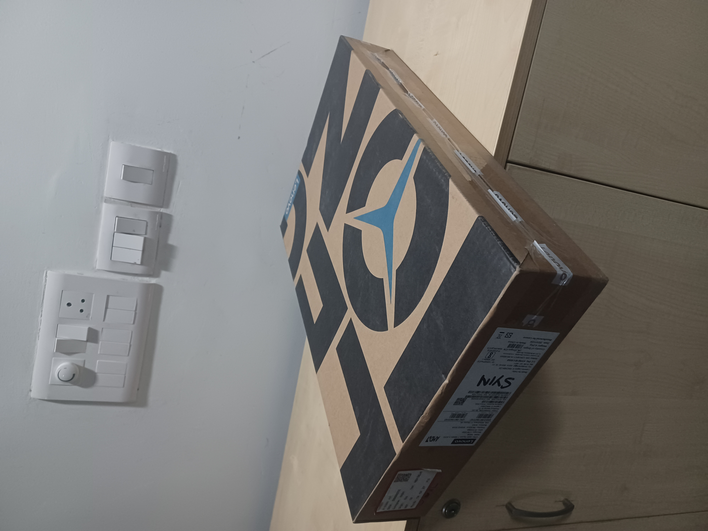

# Single-View-Metrology
3D construction of an object from a single 3-point perspective image. The homography and the projection matrices are calculated and are used to apply affine transformations to the image to obtain texture maps.

The algorithm is based on the paper [Single View Metrology](https://course.cse.ust.hk/comp5421/Password_Only/projects/svm/SingleViewMetrologyFinalReport.pdf).<br>

This project was done for the course *CSE-544: Computer Vision* offered by IIIT-D under the guidance of **Dr. Saket Anand**.

## Dependencies:
1. Python 3
2. OpenCV 
3. Numpy 
4. Pandas
5. Scipy

## How to run:
1. Clone the repository
2. Make sure that you have downloaded the *[view3dscene](https://castle-engine.io/view3dscene.php)* software and have included it in your systems path.
3. Run the following command in the parent directory:
```
./run.sh
```
4. give the image path as input to the command. Example:
```
input_imgs/image1.jpg
``` 
5. Select 7 corners from the input image while running the find_corners.py file.
6. Then, select top left and bottom right corner of the object in order to crop the image while running the svm.py file.
7. The output will be displayed in the view3dscene software.

## Results:
### Input Image:

### Output Image (3D model):
